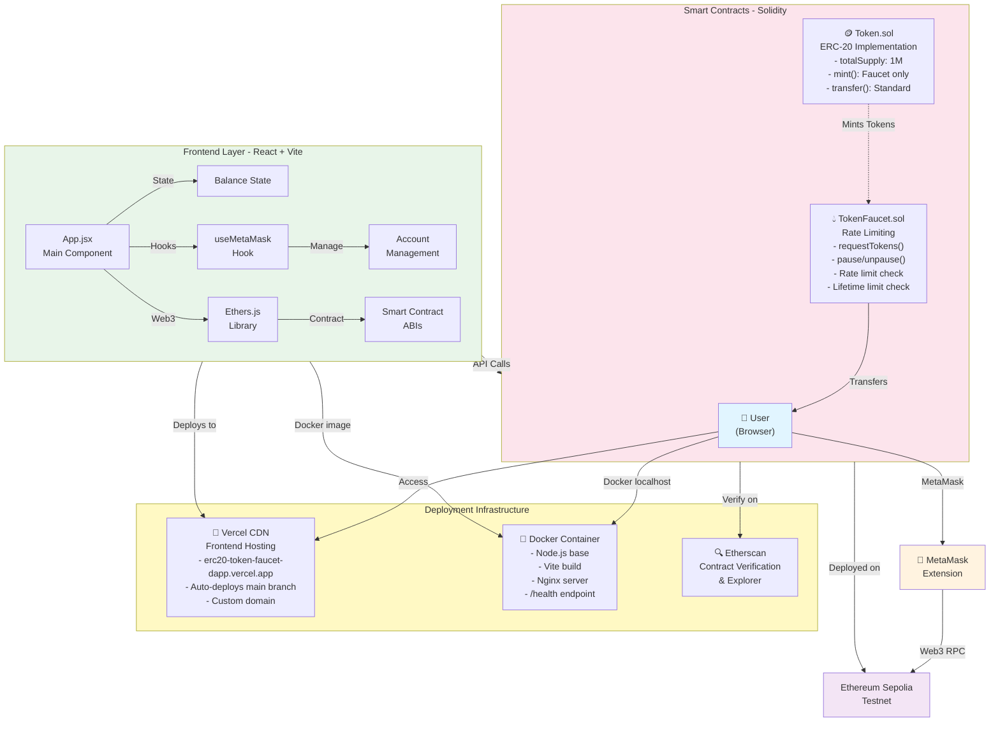
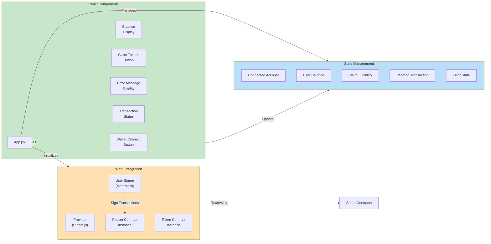
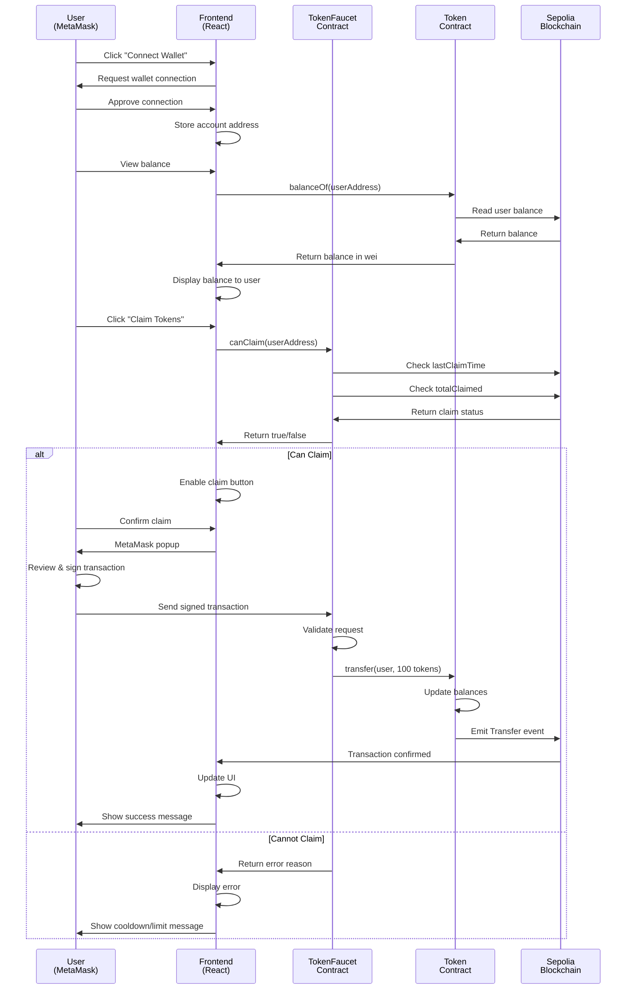
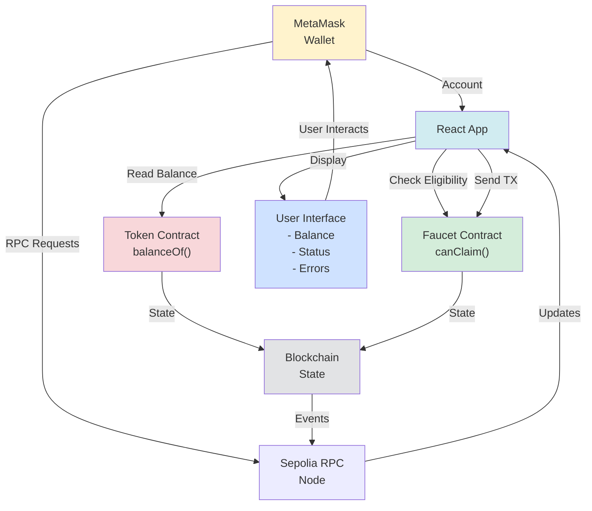
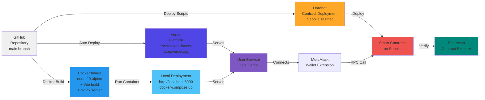
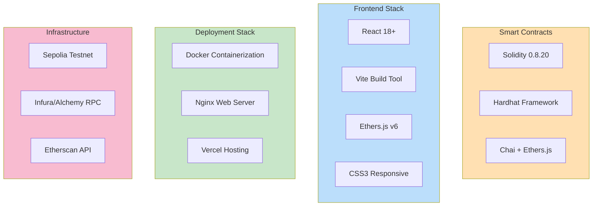
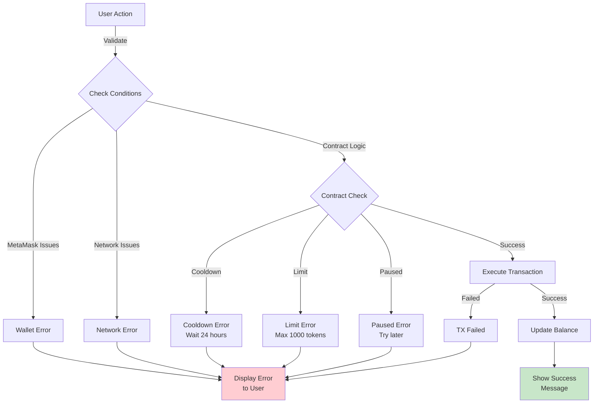

# System Architecture Diagram

Comprehensive architecture of the ERC-20 Token Faucet DApp with all component interactions.

## Overall System Architecture



## Frontend Component Architecture



## Smart Contract Interaction Flow



## Data Flow Diagram



## Deployment Architecture



## Technology Stack



## Key Design Patterns

### 1. Smart Contract Security Pattern
```
Checks → Effects → Interactions (CEI)

1. Check user eligibility
   - Cooldown period enforced
   - Lifetime limit not exceeded
   - Faucet not paused

2. Update contract state
   - Record last claim time
   - Update total claimed amount
   - Update user balance

3. Interact with external contracts
   - Token.transfer() called last
   - Ensures state consistency
```

### 2. Frontend State Management
```
MetaMask Provider → Web3 Instance → Contract Instances
                           ↓
                    React State
                    ↓
              UI Components Update
                    ↓
              User sees real-time updates
```

### 3. Rate Limiting Pattern
```
User claims tokens
    ↓
Faucet checks: lastClaimTime[user] + 24 hours > now?
    ↓
  YES: Reject with cooldown error
  NO: Check lifetime limit
    ↓
Check: totalClaimed[user] + 100 <= 1000?
    ↓
  YES: Execute transfer
  NO: Reject with limit exceeded error
```

## Error Handling Flow



## Summary

The ERC-20 Token Faucet DApp uses a **3-tier architecture**:

1. **Blockchain Layer**: Smart contracts on Sepolia testnet handling token logic
2. **Frontend Layer**: React application with MetaMask integration for user interaction
3. **Deployment Layer**: Vercel for cloud hosting and Docker for local deployment

All components communicate through Web3 interfaces, ensuring secure and decentralized token distribution with rate limiting and claim management.
