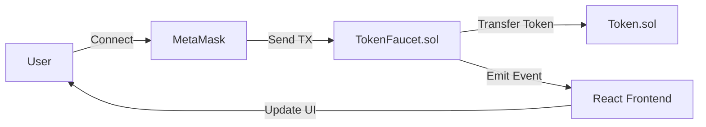

**MyToken (MTK)**
=================

A simple ERC-20 compatible token built on the Ethereum blockchain for learning purposes.This project demonstrates how fungible tokens work in Ethereum, including transfers, approvals, and event logging.

**📌 Overview**
---------------

MyToken is a basic implementation of the ERC-20 token standard.It includes all core features required by wallets, exchanges, and DeFi protocols.

**📄 Token Details**
--------------------

*   **Name:** MyToken
    
*   **Symbol:** MTK
    
*   **Decimals:** 18
    
*   **Total Supply:** 1,000,000 MTK
    
*   **Contract Address:**  0xd9145CCE52D386f254917e481eB44e9943F39138
    

**📘 What is an ERC-20 Token?**
-------------------------------

ERC-20 (Ethereum Request for Comment 20) is a widely used standard for **fungible tokens** on Ethereum.Each token is identical to another token of the same type—just like currency.

ERC-20 defines a set of rules that all compliant tokens must implement, making them compatible across:

*   Wallets
    
*   Exchanges
    
*   Smart contracts
    
*   Decentralized applications
    

This interoperability is what made ERC-20 the most popular token standard in Web3.

**✨ Features**
--------------

*   ✔️ Fully standard ERC-20 implementation
    
*   ✔️ Safe token transfers
    
*   ✔️ Allowances for delegated spending
    
*   ✔️ Transfer and Approval events
    
*   ✔️ Validation against invalid addresses or insufficient balance
    

**🚀 How to Deploy the Contract**
---------------------------------

1.  Open **Remix IDE** → [https://remix.ethereum.org/](https://remix.ethereum.org/)
    
2.  Create a file named MyToken.sol
    
3.  Paste your token’s Solidity source code
    
4.  Compile using **Solidity 0.8.x**
    
5.  Go to **Deploy & Run**
    
6.  Select **Remix VM (Cancun)**
    
7.  1000000000000000000000000(represents 1,000,000 tokens with 18 decimals)
    
8.  Click **Deploy**
    
9.  Copy the contract address and update this README
    

**🔧 Usage Examples**
---------------------

### **1️⃣ Check Balance**

Plain textANTLR4BashCC#CSSCoffeeScriptCMakeDartDjangoDockerEJSErlangGitGoGraphQLGroovyHTMLJavaJavaScriptJSONJSXKotlinLaTeXLessLuaMakefileMarkdownMATLABMarkupObjective-CPerlPHPPowerShell.propertiesProtocol BuffersPythonRRubySass (Sass)Sass (Scss)SchemeSQLShellSwiftSVGTSXTypeScriptWebAssemblyYAMLXML`balanceOf("0x5B38Da6a701c568545dCfcB03FcB875f56beddC4")`

### **2️⃣ Transfer Tokens**

To send **10 MTK**:

Plain textANTLR4BashCC#CSSCoffeeScriptCMakeDartDjangoDockerEJSErlangGitGoGraphQLGroovyHTMLJavaJavaScriptJSONJSXKotlinLaTeXLessLuaMakefileMarkdownMATLABMarkupObjective-CPerlPHPPowerShell.propertiesProtocol BuffersPythonRRubySass (Sass)Sass (Scss)SchemeSQLShellSwiftSVGTSXTypeScriptWebAssemblyYAMLXML`transfer("0xAb8483F64d9C6d1EcF9b849Ae677dD3315835cb2", 10000000000000000000)`

### **3️⃣ Approve a Spender**

To allow a DEX to spend **50 MTK** for you:

Plain textANTLR4BashCC#CSSCoffeeScriptCMakeDartDjangoDockerEJSErlangGitGoGraphQLGroovyHTMLJavaJavaScriptJSONJSXKotlinLaTeXLessLuaMakefileMarkdownMATLABMarkupObjective-CPerlPHPPowerShell.propertiesProtocol BuffersPythonRRubySass (Sass)Sass (Scss)SchemeSQLShellSwiftSVGTSXTypeScriptWebAssemblyYAMLXML`   approve("0xAb8483F64d9C6d1EcF9b849Ae677dD3315835cb2", 50000000000000000000)    `

### **4️⃣ TransferFrom (Delegated Transfer)**

Used by contracts like Uniswap, staking pools, etc.

Plain textANTLR4BashCC#CSSCoffeeScriptCMakeDartDjangoDockerEJSErlangGitGoGraphQLGroovyHTMLJavaJavaScriptJSONJSXKotlinLaTeXLessLuaMakefileMarkdownMATLABMarkupObjective-CPerlPHPPowerShell.propertiesProtocol BuffersPythonRRubySass (Sass)Sass (Scss)SchemeSQLShellSwiftSVGTSXTypeScriptWebAssemblyYAMLXML`   transferFrom("0x5B38Da6a701c568545dCfcB03FcB875f56beddC4", "0xAb8483F64d9C6d1EcF9b849Ae677dD3315835cb2", 50000000000000000000)   `

**🧪 Testing Scenarios Executed**
---------------------------------

The following features were tested successfully in Remix:

1.  ✔️ Successful compilation (Solidity 0.8.26)
    
2.  ✔️ Deployment with 1M initial supply
    
3.  ✔️ Verified metadata (name, symbol, decimals)
    
4.  ✔️ Direct transfers between accounts
    
5.  ✔️ Allowance-based transferFrom
    
6.  ✔️ Reverted transfer with insufficient balance
    
7.  ✔️ Reverted transfer to zero address
    

**📚 Lessons Learned**
----------------------

Building this token taught several important blockchain concepts:

### **🔹 Token Standards**

ERC-20 provides a predictable template for token functionality.

### **🔹 Mappings as Storage**

mapping(address => uint256) acts like the database storing account balances.

### **🔹 Events**

Essential for tracking on-chain activity and used by explorers like Etherscan.

### **🔹 Decimals System**

Solidity has no floating point, so 18 decimals simulate fractional values.

### **🔹 Approval vs Ownership**

Owning tokens ≠ being allowed to spend them.This distinction is the base of **DeFi mechanics** like swaps, staking, and liquidity pools.

**📦 Project Structure (Recommended)**
--------------------------------------

Plain textANTLR4BashCC#CSSCoffeeScriptCMakeDartDjangoDockerEJSErlangGitGoGraphQLGroovyHTMLJavaJavaScriptJSONJSXKotlinLaTeXLessLuaMakefileMarkdownMATLABMarkupObjective-CPerlPHPPowerShell.propertiesProtocol BuffersPythonRRubySass (Sass)Sass (Scss)SchemeSQLShellSwiftSVGTSXTypeScriptWebAssemblyYAMLXML`   MyToken/  │── contracts/  │   └── MyToken.sol  │── README.md  │── package.json (optional for Hardhat/Foundry)  │── scripts/ (optional)  └── tests/ (optional)   `

**🏗️ Architecture Diagram**
--------------------------

**📹 Video Demonstration**
-------------------------
[Watch the complete user journey here](https://youtube.com/your-video-link)

**📸 Screenshots**
------------------

### Wallet Connection

### Token Balance

### Successful Claim

### Error States

### Transaction Confirmation

**🚀 Docker Deployment**
------------------------
1. Ensure Docker Desktop is running.
2. Run `docker-compose up --build` in the root directory.
3. Access the frontend at `http://localhost:3000`.

**🎯 Final Notes**
------------------

This project serves as a great foundation for:

*   Learning smart contract development
    
*   Building your first ERC-20 token
    
*   Understanding DeFi interactions
    
*   Deploying to testnets like Sepolia or Holesky